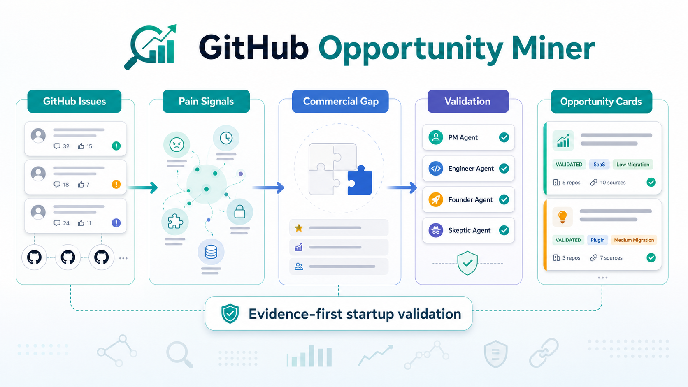

# GitHub Opportunity Miner




**GitHub Opportunity Miner** is an evidence-first AI research system for finding and validating startup opportunities hidden in open-source GitHub issues.

It does not try to invent startup ideas from thin air. It turns real developer pain into traceable SaaS, plugin, hosted-service, and workflow product opportunities.

```text
GitHub issues -> production pain -> commercial gap -> opportunity card -> validation plan
```

---

## At A Glance

| What | Description |
| --- | --- |
| Product goal | Discover startup opportunities from GitHub evidence. |
| Primary users | Founders, indie hackers, DevTool builders, product researchers, AI infra teams. |
| Input types | Broad topic, focused production pain, or `owner/repo`. |
| Output | Evidence-backed opportunity cards, buyer hypotheses, WTP signals, validation plans, and reports. |
| Default mode | Mock mode for local deterministic demos and tests. |
| Real mode | GitHub GraphQL + OpenAI-compatible LLM. |
| Storage | Local SQLite run store. |
| License | Apache-2.0. |

---

## Why This Exists

Open-source repos contain real commercial signals:

- Deployment is too hard.
- Production workflows are blocked.
- Integrations are missing.
- Enterprise features such as SSO, RBAC, audit logs, and permissions are incomplete.
- Debugging, tracing, evaluation, or observability workflows are fragmented.
- Users repeatedly ask for hosted, managed, dashboard, plugin, or template-based solutions.

Most idea generators skip the evidence layer. This project starts with evidence and keeps every important claim linked back to GitHub sources.

---

## What It Produces

A validated opportunity card includes:

| Field | Example |
| --- | --- |
| Product opportunity | `Hosted GitOps Deployment Platform for Grafana Artifacts` |
| Target user | Platform engineering, DevOps, and SRE teams. |
| User pain | Teams manage Grafana artifacts with custom automation and manual workarounds. |
| Commercial gap | Open-source Grafana is powerful, but lacks a native GitOps deployment workflow. |
| Evidence | Concrete GitHub issue URLs. |
| MVP | Declarative deployment, artifact sync, reusable templates, validation checks. |
| Buyer hypothesis | AI platform lead, DevOps lead, Head of Engineering, or CTO. |
| WTP signal | Production blocker, manual workaround, team workflow, enterprise readiness. |
| Validation plan | Contact issue authors, offer workflow audit, test clickable prototype. |
| Final decision | `build`, `validate`, `watch`, or `reject`. |

Core rule:

```text
GitHub evidence proves pain.
It does not prove payment.
Payment remains a hypothesis until validated with real users.
```

---

## Product Flow

```mermaid
flowchart LR
    A["User Query"] --> B["Scope Detection"]
    B --> C["Dynamic Search Planner"]
    C --> D["GitHub Evidence"]
    D --> E["Evidence Ranking"]
    E --> F["Issue Classification"]
    F --> G["Pain Extraction"]
    G --> H["Clustering + Dedup"]
    H --> I["Commercial Gap"]
    I --> J["Opportunity Cards"]
    J --> K["Evidence Validation"]
    K --> L["Commercial Validation"]
    L --> M["Debate + Final Judge"]
    M --> N["Report"]
```



The system automatically detects how to treat the input:

| Scope | Example | Behavior |
| --- | --- | --- |
| Broad | `Developer productivity tools` | Explore several opportunity directions. |
| Focused | `MCP auth and permissions` | Validate one production workflow pain. |
| Repo-specific | `grafana/grafana` | Analyze one GitHub repository. |
| Ambiguous | `agent` | Ask for refinement before spending tokens. |

---

## Current Status

The project is runnable locally with both mock and real modes.

Implemented:

- FastAPI backend
- Next.js local dashboard
- LangGraph workflow
- Dynamic Search Planner
- GitHub GraphQL data layer
- OpenAI-compatible LLM client
- SQLite run store
- Strict evidence validator
- Commercial validation layer
- Low Signal Diagnostics + Recovery Flow
- Live quality audit runner
- Badcase regression dataset
- Mock mode for tests and demos
- Real GitHub + real LLM mode for live analysis

Recently verified real run:

```text
Input: grafana/grafana
Evidence: 38 real GitHub items
Mock evidence: 0
Validated cards: 1
Errors: 0
```

---

## Quick Start

### Backend

```bash
cd backend
uv sync --extra dev
uv run uvicorn app.main:app --reload --host 127.0.0.1 --port 8000
```

Backend API:

```text
http://127.0.0.1:8000
```

### Frontend

```bash
cd frontend
npm install
npm run dev
```

Frontend app:

```text
http://127.0.0.1:3000
```

### Tests

```bash
cd backend
uv run --extra dev python -m pytest -q
```

```bash
cd frontend
npm run lint
npm run build
```

---

## Configuration

Create `backend/.env`.

### Mock Mode

Use mock mode for deterministic local tests and demos:

```env
APP_ENV=local
MOCK_MODE=true
VALIDATION_MODE=strict
DATABASE_URL=sqlite:///./github_opportunity_miner.db
```

### Real GitHub + LLM Mode

Use real mode to search GitHub and call an OpenAI-compatible LLM:

```env
APP_ENV=local
MOCK_MODE=false
VALIDATION_MODE=strict

GITHUB_TOKEN=your_github_token
GITHUB_GRAPHQL_URL=https://api.github.com/graphql

LLM_PROVIDER=compatible
LLM_ENABLED=true
LLM_API_KEY=your_llm_api_key
LLM_BASE_URL=https://api.deepseek.com/v1
LLM_MODEL=deepseek-chat

EMBEDDING_PROVIDER=mock
DATABASE_URL=sqlite:///./github_opportunity_miner.db
```

Important: the backend reads environment variables from the running shell. Start real mode like this:

```bash
cd backend
set -a
source .env
set +a
uv run uvicorn app.main:app --reload --host 127.0.0.1 --port 8000
```

Do not commit `.env`, local databases, live artifacts, or API keys.

---

## Public Beta Deployment

For a public trial, use a controlled beta instead of exposing unlimited live analysis.

Recommended setup:

```text
Frontend: Vercel
Backend: Railway / Render / Fly.io
Database: SQLite for tiny beta, Postgres recommended for real traffic
Secrets: platform environment variables
```

This repository includes starter deployment files:

```text
frontend/vercel.json
backend/railway.json
render.yaml
railway.json
```

### Railway Backend

Create a Railway service from the GitHub repository, then set:

```text
Root Directory: backend
Start Command: sh -c 'uv run uvicorn app.main:app --host 0.0.0.0 --port ${PORT:-8000}'
```

Why: this is a monorepo. The Python FastAPI app lives in `backend/`, and the repository root only contains subdirectories. If Railway builds from the repo root, provider detection can fail because it cannot find `pyproject.toml`.

If Railway asks for the public networking port, use the same port the app listens on. With the command above, Railway should inject `PORT`; if it does not, the fallback is `8000`.

After deployment, verify:

```text
https://your-railway-domain.up.railway.app/
https://your-railway-domain.up.railway.app/health
```

Both should return JSON. If you see `Application failed to respond`, check the deploy logs and confirm that uvicorn started on `0.0.0.0` and the same port configured in Railway networking.

### Vercel Frontend

Create a Vercel project from the same GitHub repository, then set:

```text
Root Directory: frontend
Framework Preset: Next.js
```

Public beta safety controls:

```env
PUBLIC_BETA_ENABLED=true
PUBLIC_BETA_INVITE_CODES=demo-code,partner-code
PUBLIC_BETA_DAILY_PREFLIGHT_LIMIT=20
PUBLIC_BETA_DAILY_RUN_LIMIT=3
PUBLIC_BETA_REQUIRE_PREFLIGHT=true
```

When `PUBLIC_BETA_ENABLED=true`:

- `/runs/preflight` requires a valid invite code.
- `/runs` requires a valid invite code.
- Full runs require a `preflight_id` by default.
- Daily preflight and run limits are enforced per client IP hash.

Frontend public beta config:

```env
NEXT_PUBLIC_API_BASE_URL=https://your-api.example.com
NEXT_PUBLIC_PUBLIC_BETA_ENABLED=true
```

Backend CORS config for the deployed frontend:

```env
CORS_ORIGINS=https://your-vercel-app.vercel.app
```

Production backend secrets to configure in your hosting provider:

```text
GITHUB_TOKEN
LLM_API_KEY
LLM_BASE_URL
LLM_MODEL
PUBLIC_BETA_INVITE_CODES
DATABASE_URL
```

Keep the free public beta small. Offer deeper scans, scheduled monitoring, PDF reports, team dashboards, and premium research datasets separately.

---

## Validation Modes

| Mode | Rule | Use Case |
| --- | --- | --- |
| `strict` | Each card needs at least 3 valid evidence links. | Real opportunity quality judgment. |
| `smoke` | Each card needs at least 1 evidence link. | Live pipeline debugging only. |

Strict mode is the default.

---

## Low Signal Recovery

Low signal does not always mean there is no opportunity.

It can mean:

- The query is too broad.
- The query is too narrow.
- GitHub evidence is sparse.
- Evidence exists but is scattered across unrelated pain clusters.
- The classifier found too few high-value workflow issues.
- Strict validation rejected weak cards.

The graph emits `signal_diagnostics` with counts for:

```text
raw issues
ranked evidence
high-value issues
pain points
pain clusters
opportunity hypotheses
validated cards
rejected cards
```

The system distinguishes:

| Type | Meaning | Recommended Recovery |
| --- | --- | --- |
| `evidence_sparse` | Not enough useful GitHub evidence was found. | Broaden the query or use adjacent terms. |
| `evidence_scattered` | Many GitHub items were found, but pain signals are spread across too many clusters. | Narrow to one workflow or cluster. |
| `classifier_too_strict` | Evidence exists, but too few items were classified as high value. | Include workflow friction and repeated feature requests. |
| `validator_too_strict` | Hypotheses exist, but strict evidence rules rejected them. | Inspect weak hypotheses without mixing them into validated cards. |

Weak opportunity hypotheses are clearly separated from validated cards.

---

## Commercial Validation Layer

The system moves beyond idea discovery into startup validation.

For each validated card, it can produce:

- Buyer hypothesis
- End user vs economic buyer
- Willingness-to-pay signal
- Current alternatives and workarounds
- GitHub users to contact first
- 7-day validation plan
- Startup memo
- Final decision

The report clearly separates:

```text
Evidence-backed pain
Commercial hypothesis
Validation plan
```

---

## Architecture

```text
backend/
  app/
    graph/        LangGraph state and workflow
    nodes/        Pipeline nodes
    search/       Intent, scope, dynamic search planning, ranking, expansion
    services/     GitHub GraphQL, LLM, embeddings, clustering, scoring
    commercial/   Buyer, WTP, alternatives, outreach, validation memo schemas
    harness/      Trace logging, retry, timeout, mock runner
    memory/       SQLite run and evidence stores
    eval/         Live quality audit and badcase regression
    api/          FastAPI endpoints

frontend/
  app/            Next.js routes
  components/     Topic input, run detail, cards, evidence drawer
```

| Layer | Role |
| --- | --- |
| LangGraph | Orchestrates workflow and conditional routing. |
| ContextPacket | Controls what each LLM node can see. |
| SkillRegistry | Registers tool capabilities and metadata. |
| Harness | Handles trace, timeout, retry, partial failure, and mock mode. |
| Memory | Stores runs, evidence, reports, decisions, and errors. |
| Eval | Runs live quality audits and badcase regression checks. |

---

## Main API

```text
POST /runs/preflight
POST /runs
GET  /runs
GET  /runs/{run_id}
GET  /runs/{run_id}/status
GET  /runs/{run_id}/summary
GET  /runs/{run_id}/opportunities
GET  /runs/{run_id}/report
GET  /opportunities/{opportunity_id}
GET  /opportunities/{opportunity_id}/evidence
```

Typical flow:

```text
POST /runs/preflight
-> check opportunity fit
-> POST /runs with preflight_id
-> poll /runs/{run_id}/status
-> open /runs/{run_id}
```

---

## Live Quality Audit

Run a fixed benchmark profile:

```bash
cd backend
uv run python -m app.eval.live_quality --profile rag_evaluation
```

Run dynamic live quality:

```bash
cd backend
uv run python -m app.eval.live_quality \
  --topic "MCP tools" \
  --dynamic-search true
```

Artifacts are saved for review:

```text
summary.json
state.json
report.md
validation_diagnostics.json
opportunity_cards.json
validated_cards.json
rejected_cards.json
agent_reviews.json
final_decisions.json
evidence_items.json
errors.json
search_plan.json
```

`topic_profiles.yaml` is only for evaluation benchmarks. It is not the product query configuration center.

---

## Badcase Regression

Badcases live in:

```text
backend/app/eval/badcases/
```

Run all badcases:

```bash
cd backend
uv run python -m app.eval.badcase_runner
```

Run one stage:

```bash
uv run python -m app.eval.badcase_runner --stage issue_classify
```

Badcases prevent known regressions:

- Local install bugs becoming startup opportunities.
- Weak cards entering strict reports.
- Pricing or willingness-to-pay being stated as fact.
- Duplicate cards for the same pain.
- High-migration consulting opportunities being marked as easy SaaS wins.

---

## SQLite Run Store

Runs are stored locally in SQLite:

```env
DATABASE_URL=sqlite:///./github_opportunity_miner.db
```

Reset local data:

```bash
cd backend
rm -f github_opportunity_miner.db
```

---

## Open-Core Boundary

This repository contains the open-source local framework.

| Open-source Core | Paid Or Private Layer |
| --- | --- |
| LangGraph workflow | Hosted scans |
| FastAPI backend | Scheduled monitoring |
| Next.js local dashboard | Premium benchmark profiles |
| Mock mode | Curated badcase datasets |
| Basic GitHub collection | Paid reports |
| SQLite run store | Team dashboard |
| Basic prompts | Custom market scans |
| Basic badcase examples | Full live quality artifacts |
| Architecture docs | Best-performing prompt variants |

See [docs/OPEN_CORE.md](docs/OPEN_CORE.md) for the full boundary and [examples/demo-report.md](examples/demo-report.md) for a sanitized report example.

---

## License

Apache-2.0. See [LICENSE](LICENSE).
